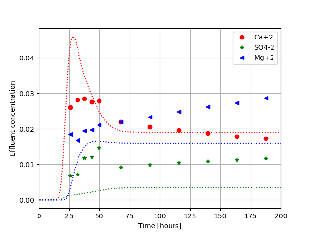
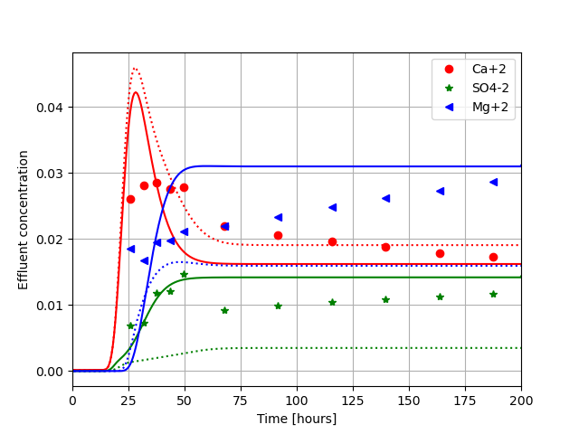

# Core flooding and the `RATE` and `INTERPOLATE` keyword
<!-- Table of contents: Run pandoc with --toc option -->

Here we will explain the `RATE` keyword and `INTERPOLATE` keyword, the latter keyword is used to speed up the chemical calculations and are explained at the end.

To illustrate the `RATE` keyword we consider a chalk core flooding of a seawater like brine (seawater, but low on NaCl). The data are from [@madland2011chemical], and the chemical rate constants are close to the values in [@hiorth2013precipitation]. The chemical reactions that takes place in the core are as follows
$$

\text{calcite} {\rightleftharpoons}\mathrm{Ca^{2+}} + \mathrm{HCO_3^-} -\mathrm{H^{+}},\\
\text{magnecite} {\rightleftharpoons}\mathrm{Mg^{2+}} + \mathrm{HCO_3^-} -\mathrm{H^{+}},\\
\text{anhydrite}{\rightleftharpoons}\mathrm{Ca^{2+}} + \mathrm{SO_{4}^{2-}}.\\

$$
The core flooding was done at a temperature of $130^\circ$ C and a pressure of 8 bars, the pore volume was 38.31 ml and a flooding rate of 1 PV/day or 0.0266 ml/hour. If we run a simulation that assumes that the core is in equilibrium with the minerals mentioned above, i.e. 

```
equilibrium_phases
calcite 1 0
anhydrite 0 0
magnesite 0 0
/end
```

where we assume that calcite (chalk) is the only mineral initially, but with a possibility of forming magnesite or anhydrite, we get the result in [figure](#fig:rate:swii).

<!-- <p><em>Comparison between GeoChemX, and data [@madland2011chemical]. Dotted lines are simulation whereas dots are experimental points <div id="fig:rate:swii"></div></em></p> -->
![<p><em>Comparison between GeoChemX, and data [@madland2011chemical]. Dotted lines are simulation whereas dots are experimental points <div id="fig:rate:swii"></div></em></p>](fig-rate/eq_swII.png)

We clearly see that there is a significant discrepancy, the calcium concentration is reasonable, but the sulphate and the magnesium concentrations are off. The reason is that there chemical reactions are time dependent. Furthermore there is also some transient behavior which is due to the fact that the reactive surface are changes [@nermoen2015porosity;@ pedersen2016dissolution]. 
## Mineral kinetics
<div id="sec:dissolution_precipitation"></div>

Rate-controlled mineral precipitation / dissolution is modelled with the
rate equation [@palandri2004compilation]
$$
\begin{equation}
\frac{dM_i}{dt} = \frac{A}{V}J_{\text{M}}^i=\frac{A}{V}
\text{sgn}(1-\Omega_i)\left(r_1^i+r_2^i a_H^{n_\text{acid}}\right)
\left|1-\Omega_i^m\right|^n\,,
\end{equation}
$$
where $M_i$ is the concentration of mineral $i$ (mol/L), $A_i$ is the
surface area of mineral $i$ (m$^2$), $V$ is the volume of fluid ($L$),
$r_{1,2}$ are rate constants (mol/m$^2$/s), $m$, $n$, and $n_{\text{acid}}$ are
exponents indicating the order of reaction,
and $\Omega_i$ is the \emph{saturation state} of mineral $i$.
Saturation state is related to \emph{saturation index}, $SI$, via:
$$

\Omega \equiv = \frac{IAP}{K} \,. \\
SI \equiv \log_{10}{\Omega} \,.

$$
The change in the total basis species concentration due to dissolution
and precipitation can be written:
$$

\frac{dc_i}{dt} = S_g J_R^i \\
J_R^i = \sum_j\nu_{ij}\text{sgn}(1-\Omega_j)\left(k_1^i+k_2^i
a_H^{n_\text{acid}}\right)\left|1-\Omega_j^m\right|^n \,,

$$
where the sum goes over all the minerals present, $\nu$ is the
stoichiometric matrix, and $S_g\equiv{A/V}$ is the specific surface area ($\text{m}^2/\text{L}$). 
The temperature-dependence is captured by an Arrhenius-type relation:
$$
\begin{equation}
k_{j}(T)=k_{j}(T_\text{ref})\cdot\exp{\left[-\frac{\epsilon_{a,j}^i}{R}
\cdot\left(\frac{1}{T}-\frac{1}{T_\text{ref}}\right)
\right]}\,.
\end{equation}
$$
Here we have dropped the superscript indicating the mineral index.
These two activation energies, $\epsilon_{a,1}^i$, and $\epsilon_{a,2}^i$ (J/mol),
must be input by the user (default: zero).

### Rate input
The `rate` input has the following syntax, where all the parameters are described above 

```
rate
# rate = (k_1*exp(-Ea/Rg)(1/T-1/298.15)+k_2*a_H*exp(-Ea/Rg)(1/T-1/298.15)*(1-SI^n)^m
#mineral   wt-fraction	Sg   log_af   Ea_1    k_1       Ea_2	k_2	n	m
calcite 	1	5220	0     37.8e3  1.54e-6	35.4e3	0.52	1	1
magnesite	0	1	0     60e3    5.48e-11	0.0	0.0	1	1
anhydrite	0	1	0	0     5e-8	0.0	0.0	1	1
/ end
```

The values for calicte are the same as the one published in [@palandri2004compilation], for magnesite and anhydrite the values are close to the ones used in [@hiorth2013precipitation]. Anhydrite precipitation values are just fit to data, and therefore the activation energy is put to zero, i.e. the temperature dependence is neglected. A limitation of the current rate equation is that the reactive surface area is probably changing as a function of time, which would greatly impact the rate. 

Running the input file below we get the results shown in [figure](#fig:rate:swii_rate). The simulation is now closer to the observed values, but we still do not capture the full time dependency, which is most likely due to time dependency of the reactive surface area [@nermoen2015porosity;@ pedersen2016dissolution]. 

<!-- <p><em>Comparison between GeoChemX, and data [@madland2011chemical]. Dotted lines are simulation assuming equilibrium, and solid lines are assuming rates. <div id="fig:rate:swii_rate"></div></em></p> -->
![<p><em>Comparison between GeoChemX, and data [@madland2011chemical]. Dotted lines are simulation assuming equilibrium, and solid lines are assuming rates. <div id="fig:rate:swii_rate"></div></em></p>](fig-rate/rate_swII.png)

### Full input file


```
Tf  200
Temp 130
Pres 800000.0
Imp 0
VolRate 0.0266
Volume 38.31
NoBlocks 20
Flush 0.5
debug 0
#interpolate 10000
WriteNetCDF 1
porosity 0.5

chemtol
1e-7 1e-8
/end

geochem
solution 0 
pH 7 charge
Ca 1e-8
HCO3 1e-8
/end

iexchange
X 0.09
/ end

# uncomment and remove rate keyword to run pure
# equilibrium calculations
#equilibrium_phases
#calcite 1 0
#anhydrite 0 0
#magnesite 0 0
#/end

rate
# rate = (k_1*exp(-Ea/Rg)(1/T-1/298.15)+k_2*a_H*exp(-Ea/Rg)(1/T-1/298.15)*(1-SI^n)^m
#mineral   wt-fraction	Sg   log_af   Ea_1    k_1       Ea_2	k_2	n	m
calcite 	1	5220	0     37.8e3  1.54e-6	35.4e3	0.52	1	1
magnesite	0	1	0     60e3    5.48e-11	0.0	0.0	1	1
anhydrite	0	1	0	0     5e-8	0.0	0.0	1	1
/ end

solution 1
--Injected brine
pH 7 charge
HCO3	0.002
Cl	0.1251
SO4	0.024
Mg	0.0445
Ca	0.013
Na	0.05
K	0.01
/end

/end

```

### Running code
The file is run by using `TRANSPORT` keyword on the command line

```
Terminal>GeoChemX TRANSPORT <input_file>
```

## `INTERPOLATE` keyword
The mathematics of the method is described in Appendix 2 of [@feldmann2024iorsim]. In simple terms `GeoChemX` stores the result of the chemical concentrations if the `INTERPOLATE` flag is turned on. The number behind the `INTERPOLATE` keyword determines the binning of the solution, and then the chemical solver picks the *closest* solution. The assumption is that if the mineral combination is known in the block, along with the temperature, time step, and total concentration of basis species the solution is known and we can just look it up. Temperature and time step is stored on a linear scale, whereas chemical concentrations are stored as log values. Hence, if we enter the combination

```
INTERPOLATE 10
```

Temperatures and time steps (in seconds) that differs by 0.1 are considered equal, and concentrations that differs by 0.1 on *log scale*, i.e. a solution pH of 7.1 would be equal to 7.0 and so on for the rest of the chemical species (including surface species). By increasing to `INTERPOLATE 100` we store more solutions. Another important point to mention is that we do not store the absolute values of the calculated solution, but the differences. This is to make sure that the solution always is charge balanced. The challenge with this approach is that when surface complexes or ion exchange are active, we need a number of around 1000 to get accurate solutions.  

A simple test on a laptop shows that for this case, using `INTERPOLATE 10000` speeds up the calculation by a factor of 3. For bigger simulations the speed up will be significant bigger. In a reservoir simulation with millions of blocks, there will only be changes in a subset of blocks that needs to be calculated.

## Bibliography

 1. <div id="madland2011chemical"></div> **M. Madland, A. Hiorth, E. Omdal, M. Megawati, T. Hildebrand-Habel, R. Korsnes, S. Evje and L. Cathles**.  Chemical Alterations Induced by Rock-Fluid Interactions When Injecting Brines in High Porosity Chalks, *Transport in porous media*, 87(3), pp. 679-702, 2011.
 2. <div id="hiorth2013precipitation"></div> **A. Hiorth, E. Jettestuen, L. Cathles and M. Madland**.  Precipitation, Dissolution, and Ion Exchange Processes Coupled With a Lattice Boltzmann Advection Diffusion Solver, *Geochimica et Cosmochimica Acta*, 104, pp. 99-110, 2013.
 3. <div id="nermoen2015porosity"></div> **A. Nermoen, R. I. Korsnes, A. Hiorth and M. V. Madland**.  Porosity and Permeability Development in Compacting Chalks During Flooding of Nonequilibrium Brines: Insights From Long-Term Experiment, *Journal of Geophysical Research: Solid Earth*, 120(5), pp. 2935-2960, 2015.
 4. <div id="pedersen2016dissolution"></div> **J. Pedersen, E. Jettestuen, M. V. Madland, T. Hildebrand-Habel, R. I. Korsnes, J. L. Vinningland and A. Hiorth**.  A Dissolution Model That Accounts for Coverage of Mineral Surfaces by Precipitation in Core Floods, *Advances in Water Resources*, 87, pp. 68-79, 2016.
 5. <div id="palandri2004compilation"></div> **J. L. Palandri and Y. K. Kharaka**.  A Compilation of Rate Parameters of Water-Mineral Interaction Kinetics for Application to Geochemical Modeling, *Geological Survey Menlo Park CA*, 2004.
 6. <div id="feldmann2024iorsim"></div> **F. Feldmann, O. Nodland, J. Sagen, B. Antonsen, T. Sira, J. L. Vinningland, R. Moe and A. Hiorth**.  IORSim: a Mathematical Workflow for Field-Scale Geochemistry Simulations in Porous Media, *Transport in Porous Media*, 151(9), pp. 1781-1809, 2024.


