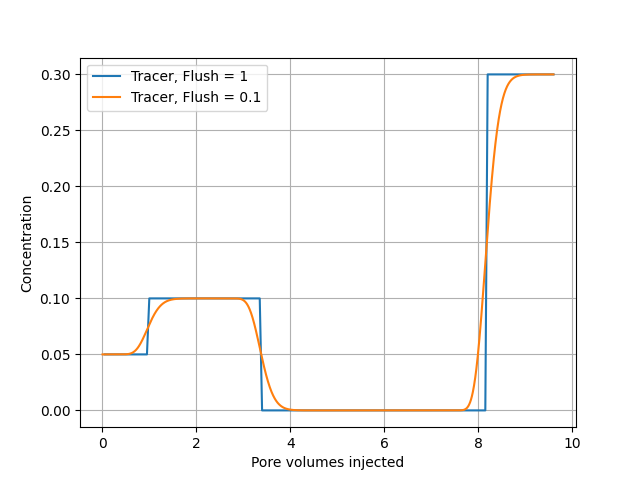

# 1 Dimensional tracer modeling
<!-- Table of contents: Run pandoc with --toc option -->

This input file defines a one-dimensional reactive transport simulation in which multiple injected fluids are flushed through a porous column. The example demonstrates coupling between advection, aqueous geochemistry, and time-dependent injection schedules.

The goal of this simulation is to illustrate:
* One-dimensional advective transport through a porous medium
* Sequential injection of different solutions with different tracer concentrations
* Time-dependent flow rates
* Coupling of transport with geochemical equilibration

*Notice.* 
The example is intentionally simple and focuses on transport behavior, not mineral reactions, ion exchange or surface complexation. There is only a pH calculation done for each step.

 

### Input file

```
Temp 130
Pres 800000.0
Imp 0
#VolRate 0.2
# ml
Volume 40
NoBlocks 20
Flush 1
debug 0

porosity 0.5

#add_species "ions.txt"
BASIS_SPECIES
# Name a0 Mw analytical logK 
Tracer 5 5 /ANA 0 /
/end


NumericalJacobian 0
chemtol
1e-7 1e-8
/end

INJECT 1
#solution name, time [hours], flow rate [ml/hour]
1 8 0.2
/end

INJECT 0
#solution name, time [hours], flow rate [ml/hour]
0 8 0.4
/end

INJECT 3
#solution name, time [hours], flow rate [ml/hour]
2 16 0.1
/end

geochem

solution 0 
--Initial solution in column
Tracer 0.05
/end

solution 1
--Injected brine 1
Tracer .1
/end

solution 2
--Injected brine 2
Tracer .3
/end
/end

```

*Explanation of input file:*

*Global model settings:*
`Temp`:
  :    
  Temperature inside column of 130 $^\circ\text{C}$
`Pres`:
  :    
  pressure of solution, units: Pascal, default $8\cdot 10^5$ Pa
`Imp`:
  :    
  Implicit (`Imp` = 1) or explicit (`Imp` = 0) integration.

*Column geometry and discretization:*
`Volume`:
  :    
  Total column volume, 40 mL
`NoBlocks`:
  :    
  Number of grid blocks, 20
`Porosity`:
  :    
  porosity 0.5

*Transport control flags:*
`Flush`:
  :    
  Controls how much of the pore volume of each block is flooded during a time step. If `Flush=1`, exactly the time step is chosen such that 1 block pore volume is flushed during each simulation time step.
`debug`:
  :    
  writes extra information to screen, if set to zero output is disabled.

*Chemical system information:*
`BASIS_SPECIES`:
  :    
  user defined specie, the user has to give in the molecular weight, the Bohr radius and a model for the logK. If `ANA` is used the numbers $a_1\ldots a_6$ has to be entered and the following formula is used

$$
\begin{equation}
\log_{10} K = a_1 + a_2 T + \frac{a_3}{T} + a_4\log_{10}{T} + \frac{a_5}{T^2} + a_6 T^2.
\end{equation}
$$
Here $\log K = 0$. Optionally `HKF` may be used, then we use the HKF equation of state [@helgeson1974theoretical;@helgeson1981theoretical], the default values already implemented are those defined in the SUPCRT thermodynamic database [@johnson1992supcrt92].


```
BASIS_SPECIES
# name a0 mol_weight
# HKF parameters: DeltaG DeltaH S a1 a2 a3 a4 c1 c2 omega
ACE- 5 59.04 / HKF -88270 -116160 20.6 7.7525 8.6996 7.5825 -3.1385 26.3 -3.86 1.3182 /
/end

SECONDARY_SPECIES
# DeltaG DeltaH S a1 a2 a3 a4 c1 c2 omega
ACEH = ACE- + H+ /HKF -94760 -116100 42.7 11.6198 5.218 2.5088 -2.9946 42.076 -1.5417 -0.15 /
/end

MINERAL_PHASES
# HKF parameters: mol_volume DeltaG DeltaH S a1 a2 a3 a7
WITHERITE = Ba+2 + HCO3- - H+ / HKF 45.81 -278400 -297500 26.8 21.5 11.06 -3.91 /
/end
```

*Units for HKF.* 
The input values must use the same units  as in the paper by [@johnson1992supcrt92]


*Optional numerical constraints:*
`Numericalacobian`:
  :    
  if zero, analytical Jacobian is used. Should always be zero, but in case the solver does not converge one can try to put it to 1, which would indicate a bug in the analytical implementation.
`chemtol`:
  :    
  Sets numerical convergence criteria, default is `1e-7 1e-8`.
  * Solver uses one loop for mass balance, and a second outer loop for pH or charge balance. The first number controls the convergence of mass balance and the second, charge balance.


*Injection schedule:*
The simulation uses three injection stages, each defined by an `INJECT` block.

```
INJECT 1
#solution name, time [hours], flow rate [ml/hour]
1 8 0.2
/end
```

* Injected solution: solution 1
* Duration: 8 hours
* Flow rate: 0.2 mL/hour

*Flow rate.* 
It is possible to use the global keyword `VolRate` if the flow rate is kept constant during simulation.


*Geochemical definitions:*
`geochem .. /end`: defines the geochemical block

*Initial column solution.* 
The initial column solution is *always the first one*, and in this case `solution 0`. Ion exchange, mineral reactions has to come right after this solution.


The simulation set up:
* The column is initialized with solution 0
* Solution 1 is injected for 8 hours at low flow
* The tracer is removed by flushing with solution 3 at higher flow
* Solution 2 is injected for 16 hours at low flow

### Running code
The file is run by using `TRANSPORT` keyword on the command line

```
Terminal>GeoChemX TRANSPORT <input_file>
```

### Description of output
Transport and aqueous chemistry are solved sequentially in each grid block. In the file `<root_name>OneDEff.out` the time steps, pore volumes and concentrations are tabulated, and can easily be imported in to python using Pandas `pandas.read_csv("<root_name>OneDEff.out", sep ="\t")`.

```
#<root_name>OneDEff.out
Time	PVinj	Tracer	pH
0.0166667	0.005	0.05	5.92069
0.0333333	0.01	0.05	5.92069
0.05		0.015	0.05	5.92069
0.0666667	0.02	0.05	5.92069
....
```

In [figure](#fig:trans) we show the effluent concentration for different values of the `Flush` keyword. Note that there is no numerical dispersion for `Flush=1`, by adjusting this value one can also model diffusion and dispersion.

<!-- <p><em>Tracer concentrations out of the core, `Flush=1` and `Flush=0.1`. <div id="fig:trans"></div></em></p> -->


*Equilibration of injected solutions.* 
Before solutions are injected into the column *they are equilibrated*, this is a necessary step to estimate a pH for the solution. Therefore the solver equilibrates the solution before injecting, the results of those calculations are stored in the files `<root_namegt;_init_lt;solution_name>_aq.out`, `<root_namegt;_init_lt;solution_name>_buffer.out`, `<root_namegt;_init_lt;solution_name>_species.out` and `<root_namegt;_init_lt;solution_name>_solution.out`.


## Appendix: Numerical transport algorithm
### Finite Volume (FV) discretization

The Finite Volume (FV) method is based on the integral form of the mass
balance equations [@hirsch2007numerical],
$$

\frac{1}{\partial t}\left(\int_{V} \phi c_{i}\,dV\right)
+ \int_{A=\partial V} \overrightarrow{J_{i}}^t \cdot \hat{\overrightarrow{n}}\,dA
= \int_{V} \phi r_i\,dV\,,

$$
where $\hat{\overrightarrow{n}}$ is the outward-pointing normal vector to the
boundary $A$ of the volume $V$. This equation can be rewritten in terms
of *volume-averaged* variables as follows:
$$

V\cdot\partial_t{\langle{\phi c_i}\rangle}
+ \int_{A=\partial V} \overrightarrow{J_{i}}^t \cdot \hat{\overrightarrow{n}}\,dA
= V\cdot{\langle{\phi r_i}\rangle}\,.

$$
By integrating this equation from $t=t_i$ to $t_f=t_i+\Delta t$, we find:
$$

V\cdot\left[{\langle{\phi c_i}\rangle}^{n+1}-{\langle{\phi c_i}\rangle}^{n}\right]
+ \int_{t_i}^{t_f}\int_{A=\partial V} \overrightarrow{J_{i}}^t \cdot \hat{\overrightarrow{n}}\,dA\,dt
= V\cdot\Delta t\cdot{\langle{\phi r_i}\rangle}^{\star}\,,

$$
where the $\star$-superscript denotes the *time-average*. The flux term can
be written as
$$

\int_{t_i}^{t_f}\int_{A=\partial V} \overrightarrow{J_{i}}^t \cdot \hat{\overrightarrow{n}}\,dA\,dt
= \int_{t_i}^{t_f}\displaystyle\sum_{A_f\in{A}} \int_{A_f} \overrightarrow{J_{i}}^t \cdot \hat{\overrightarrow{n}}\,dA\,dt \nonumber \\
= \displaystyle\sum_{A_f\in{A}} \int_{A_f} \int_{t_i}^{t_f}\overrightarrow{J_{i}}^t \cdot \hat{\overrightarrow{n}}\,dt\,dA\nonumber \\
= \Delta t\displaystyle\sum_{A_f\in{A}} \int_{A_f}
\left(\overrightarrow{J_{i}}^t \cdot \hat{\overrightarrow{n}}\right)^{\star}\,dA \\
\approx
\Delta t\displaystyle\sum_{A_f\in{A}}
\left\{
\theta \left(\overrightarrow{J_{i}}^t \cdot \hat{\overrightarrow{n}}\right)_f^{n+1}
+  (1-\theta) \left(\overrightarrow{J_{i}}^t \cdot \hat{\overrightarrow{n}}\right)_f^{n}
\right\}\cdot |A_f| \,.

$$
In the last line, we have approximated the time-averaged flux term as a
weighted arithmetic average of the flux terms at times $t_i$ and $t_f$
(i.e., a Crank-Nicolson method).
For purely advective flow, $\overrightarrow{J_{i}}^t=\overrightarrow{u}c_{i}$, thus
$$

-\int_{t_i}^{t_f}\int_{A=\partial V} \overrightarrow{J_{i}}^t \cdot \hat{\overrightarrow{n}}\,dA\,dt
\approx \Delta t \cdot\theta\displaystyle\sum_{A_f\in{A}}(Qc_{i})_f^{n+1}
+ \Delta t \cdot(1-\theta)\displaystyle\sum_{A_f\in{A}}(Qc_{i})_f^{n}
\nonumber \\
=
\Delta t \cdot\theta\left(
\displaystyle\sum_{A_f\in{A}}(Q_{in}c_{i})_f^{n+1}
-\displaystyle\sum_{A_f\in{A}}(Q_{out}c_{i})_f^{n+1}
\right)\nonumber \\
+\Delta t \cdot(1-\theta)\left(
\displaystyle\sum_{A_f\in{A}}(Q_{in}c_{i})_f^{n}
-\displaystyle\sum_{A_f\in{A}}(Q_{out}c_{i})_f^{n}
\right)
\,,

$$
where $Q_f$ is the volumetric flow rate across the face $A_f$, with $Q_f>0$
for flow *into* the volume (notice the minus sign on the left-hand side).
In turn, we have $Q_f=Q_{in, f}-Q_{out, f}$
for $Q_{in, f}=\text{max}(Q_f, 0)$ and $Q_{out, f}=\text{max}(-Q_f, 0)$.
The same approximation of the time-average is applied to the
reaction term, yielding
$$

{\langle{V_pc_{i}\rangle}}^{n+1}-{\langle{V_pc_{i}\rangle}}^{n}
=
\Delta t \cdot\theta\left(
\displaystyle\sum_{A_f\in{A}}(Q_{in}c_{i})_f^{n+1}
-\displaystyle\sum_{A_f\in{A}}(Q_{out}c_{i})_f^{n+1}
\right) \nonumber \\
+ \Delta t \cdot\theta{\langle{V_p r_i}\rangle}^{n+1}\nonumber \\
+\Delta t \cdot(1-\theta)\left(
\displaystyle\sum_{A_f\in{A}}(Q_{in}c_{i})_f^{n}
-\displaystyle\sum_{A_f\in{A}}(Q_{out}c_{i})_f^{n}
\right) \nonumber \\
+ \Delta t \cdot(1-\theta){\langle{V_p r_i}\rangle}^{n}
\,.

$$
We assume that porosity is constant inside the volume and, by abuse of
notation, we replace the time-averaged concentration and reaction term
with the original variables:
$$

V_p^{n+1}c_{i}^{n+1}
+ \Delta t \cdot\theta\cdot\displaystyle\sum_{A_f\in{A}}(Q_{out}c_{i})_f^{n+1}
= V_p^{n}c_{i}^{n} \nonumber \\
+ \Delta t \cdot\theta\cdot\displaystyle\sum_{A_f\in{A}}(Q_{in}c_{i})_f^{n+1} \nonumber \\
+ \Delta t \cdot\theta \cdot V_p^{n+1} r_{i}^{n+1}\nonumber \\
+\Delta t \cdot(1-\theta)\left(
\displaystyle\sum_{A_f\in{A}}(Q_{in}c_{i})_f^{n}
-\displaystyle\sum_{A_f\in{A}}(Q_{out}c_{i})_f^{n}
\right) \nonumber \\
+ \Delta t \cdot(1-\theta)\cdot V_p^{n} r_{i}^{n}
\,.

$$
Next, we apply *upstream weighting*:
$$

c_{i}^{n+1}\left(
V_p^{n+1} + \Delta t \cdot\theta\displaystyle\sum_{A_f\in{A}} Q_{out, f}^{n+1}
\right)
= V_p^{n}c_{i}^{n} \nonumber \\
+ \Delta t \cdot\theta\cdot\displaystyle\sum_{A_f\in{A}}(Q_{in}c_{i})_f^{n+1} \nonumber \\
+ \Delta t \cdot\theta \cdot V_p^{n+1} r_{i}^{n+1} \nonumber \\
+\Delta t \cdot(1-\theta)\cdot\displaystyle\sum_{A_f\in{A}}(Q_{in}c_{i})_f^{n}\nonumber \\
-\Delta t \cdot(1-\theta)\cdot c_{i}^{n}\displaystyle\sum_{A_f\in{A}} Q_{out, f}^{n} \nonumber \\
+ \Delta t \cdot(1-\theta)\cdot V_p^{n} r_{i}^{n}
\,.

$$
If we specialize to an *implicit* time-discretization ($\theta=1$), we get:
$$

c_{i}^{n+1} = \frac{V_p^{n}c_{i}^{n} + \Delta t \cdot\left(C_{\text{inflow}}^{n+1}+  V_p^{n+1} r_{i}^{n+1}\right)}
{V_p^{n+1} + \Delta t \cdot Q_{out}^{n+1}}
\,,

$$
in which we have defined
$$

C_{\text{inflow}} \equiv \displaystyle\sum_{A_f\in{A}}(Q_{in}c_{i})_f \,,\text{ and} \\
Q_{out} \equiv \displaystyle\sum_{A_f\in{A}} Q_{out, f} \,.

$$
On the other hand, an explicit time discretization ($\theta=0$) yields:
$$

c_{i}^{n+1} = \frac{
c_{i}^{n}\left(V_p^{n} - \Delta t Q_{out}^{n}\right)
+ \Delta t\cdot\left(C_{\text{inflow}}^{n} + V_p^{n}r_{i}^{n}\right)}
{V_p^{n+1}}\,.

$$

## Bibliography

 1. <div id="helgeson1974theoretical"></div> **H. C. Helgeson and D. H. Kirkham**.  Theoretical Prediction of the Thermodynamic Behavior of Aqueous Electrolytes at High Pressures and Temperatures; I, Summary of the Thermodynamic/electrostatic Properties of the Solvent, *American Journal of Science*, 274(10), pp. 1089-1198, 1974.
 2. <div id="helgeson1981theoretical"></div> **H. C. Helgeson, D. H. Kirkham and G. C. Flowers**.  Theoretical Prediction of the Thermodynamic Behavior of Aqueous Electrolytes by High Pressures and Temperatures; IV, Calculation of Activity Coefficients, Osmotic Coefficients, and Apparent Molal and Standard and Relative Partial Molal Properties to 600 Degrees C and 5kb, *American journal of science*, 281(10), pp. 1249-1516, 1981.
 3. <div id="johnson1992supcrt92"></div> **J. W. Johnson, E. H. Oelkers and H. C. Helgeson**.  SUPCRT92: a Software Package for Calculating the Standard Molal Thermodynamic Properties of Minerals, Gases, Aqueous Species, and Reactions From 1 to 5000 Bar and 0 to 1000 C, *Computers  Geosciences*, 18(7), pp. 899-947, 1992.
 4. <div id="hirsch2007numerical"></div> **C. Hirsch**.  *Numerical Computation of Internal and External Flows: the Fundamentals of Computational Fluid Dynamics*, Elsevier, 2007.


