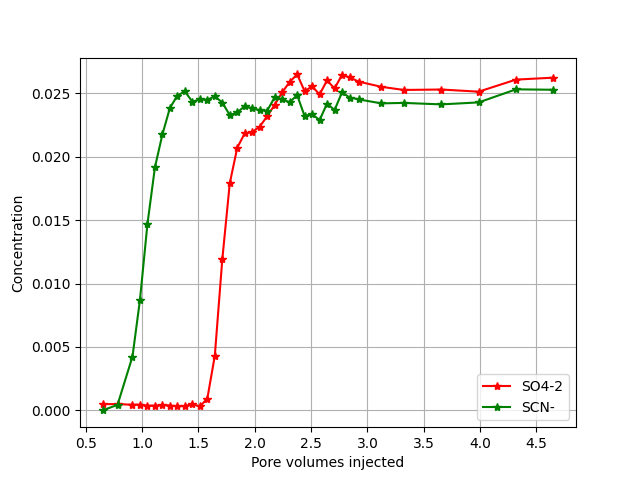
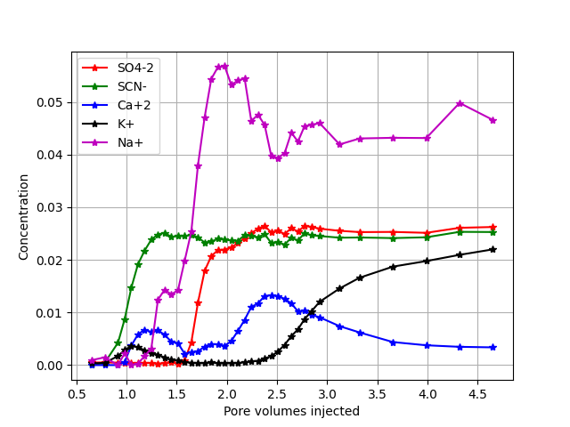
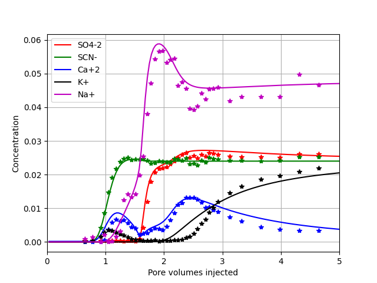
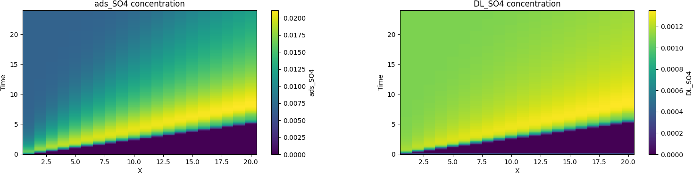

# Adsorption of sulphate and cation exchange in core
<!-- Table of contents: Run pandoc with --toc option -->

## Introduction

Adsorption of sulphate has been the subject of much research as it is believed to be one of the key players of wettability alteration in chalk [@fathi2010smart]. In many core experiments sulphate adsorption is also used to measure the wettability of rock material [@strand2006wettability]. The adsorption of sulphate is measured relative to a an inert tracer like $\text{SCN}^⁻$, typically what one observe and reports in publications are the delay of the sulphate ion relative to $\text{SCN}^⁻$. This is illustrated below using data from [@hiorth2011effect;@megawati2013impact].

<!-- <p><em>Experimental data [@megawati2013impact] from a Liege chalk core flood, where there is a delay of sulphate. <div id="fig:tr:sulph"></div></em></p> -->
![<p><em>Experimental data [@megawati2013impact] from a Liege chalk core flood, where there is a delay of sulphate. <div id="fig:tr:sulph"></div></em></p>](fig-transportII/sulphate_anion.png)

The area between the tracer and sulphate curve is suggested to be a direct measure of wettability [@strand2006wettability]. However, the cation profiles are rarely shown in these experiments, in [figure](#fig:tr:sulph2) the measured cations are shown. 

<!-- <p><em>Full experimental ion profile [@megawati2013impact] from a Liege chalk core flood. <div id="fig:tr:sulph2"></div></em></p> -->
![<p><em>Full experimental ion profile [@megawati2013impact] from a Liege chalk core flood. <div id="fig:tr:sulph2"></div></em></p>](fig-transportII/sulphate_cation.png)

The full ion profile reveals a complicated pattern, below we demonstrate how to model this data set using equilibrium reactions, ion exchange and surface complexation.

### Input file

```
Tf  24
Temp 130
Pres 800000.0
Imp 0
# ml/min
VolRate 0.2
# ml
Volume 39.1
NoBlocks 20
Flush .7
debug 0

WriteNetCDF 1
porosity 0.5

BASIS_SPECIES
# Name a0 Mw
SCN- 5 58.08 / HKF 909090 9 /
/end

chemtol
1e-7 1e-8
/end

INJECT 0
#solution name, time, flow rate
1 24 
/end

geochem

solution 0 
--Initial solution in column
pH 7 charge
HCO3  1.0E-08
Ca  1.0E-08
/end

complex
method 1
#specific surface area m^2/L pore volume, size of diffusion layer
s_area 5000.0 10
#donnan
#Name sites/nm^2
GCa 4.95
GCO3 4.95
/ end

iexchange
X 0.09
/ end

equilibrium_phases
calcite 1 0
/end

solution 1
--Injected brine
pH 7 charge
Na  4.8E-02
K  2.4E-02
SCN-  2.4E-02
SO4  2.4E-02
/end
/end

```

All the different blocks have been covered in [solution example](../../solution/markdown/main_solution.md), [ion exchange example](../../iexchange/markdown/main_iexchange.md), [surface complex example](../../complex/markdown/main_complex.md), and [equilibrium phases example](../../equilibrium_phases/markdown/main_equilibrium_phases.md). The transport module is described in [transport example](../../transport/markdown/main_transport.md) The effluent profiles for simulation and data is shown in [figure](#fig:tr:sulph3).

<!-- <p><em>Full experimental ion profile, dots [@megawati2013impact], and model results (solid lines). <div id="fig:tr:sulph3"></div></em></p> -->
![<p><em>Full experimental ion profile, dots [@megawati2013impact], and model results (solid lines). <div id="fig:tr:sulph3"></div></em></p>](fig-transportII/transport.png)

*Model assumptions:*
1. local equilibrium between pore water and calcite, which is reasonable as the temperature is quite high
2. local equilibrium between diffusive double layer and the calcite surface
3. a quite high ion exchange capacity which is a consequence of non carbonate minerals, which is in line with experiments [@megawati2013impact].

### Running code
The file is run by using `TRANSPORT` keyword on the command line

```
Terminal>GeoChemX TRANSPORT <input_file>
```

## Network Common Data Form
The solver can optionally write simulation results to a NetCDF (Network Common Data Form) file. NetCDF is a self-describing, binary file format widely used in the geosciences, climate modeling, and fluid dynamics.

NetCDF files are particularly well suited for reactive transport simulations because they:

/* Store multi-dimensional data (space $\times$ time $\times$ species)
* Preserve coordinate information (e.g., position, time)
* Are portable across platforms
* Can be efficiently read by Python, MATLAB, R, Julia, and visualization tools

Here, NetCDF output is enabled using an input option such as:

```
WriteNetCDF 1
```

The output is written in the file `<root_name>_NC`

*Structure of the NetCDF dataset:*

The NetCDF file contains:
* Dimensions
* $X$ - spatial coordinate along the 1-D column
* $T$ - simulation time

*Variables:*
Each aqueous component (e.g., $\mathrm{Ca^{2+}}$, $\mathrm{Mg^{2+}}$, Tracer) is stored as a variable with dimensions $(T, X)$.

### Loading the NetCDF file in Python
The recommended way to work with NetCDF output in Python is using xarray, which provides labeled, N-dimensional arrays.

```
import xarray as xr
import matplotlib.pyplot as plt

ds = xr.open_dataset("transport_NC")
ds.load()   # read all variables into memory
ds.close()
```

`xr.open_dataset(...)`:
  :    
  opens the NetCDF file lazily (data are not read immediately)
`ds.load()`:
  :    
  loads all variables into memory (recommended for small–medium datasets)
`ds.close()`:
  :    
  closes the file handle once data are loaded

### Plotting NetCDF file in Python
To plot chemical species as a function of time, one can use the following code,`DL_SO4` is the concentration of sulphate in the double layer and `ads_SO4` is the total sulphate concentration adsorbed i.e. double layer, surface complexation and on exchange sites.

```
ion = 'DL_SO4'
#ion = 'ads_SO4'
plt.figure(figsize=(8, 4))
plt.pcolormesh(ds["X"], ds["T"], ds[ion], shading="auto")
plt.colorbar(label=ion)
plt.xlabel("X")
plt.ylabel("Time")
plt.title( ion + " concentration")
plt.show()
```

<!-- <p><em>(left) total sulphate concentrationa and (right) sulphate in the diffusive layer. <div id="fig:transII:adsso"></div></em></p> -->


[Figure](#fig:transII:adsso) shows the time development and along the core of sulphate adsorbed and the double layer concentration. Note that there is a maximum concentration before it reaches steady state.

## Bibliography

 1. <div id="fathi2010smart"></div> **S. J. Fathi, T. Austad and S. Strand**.  Smart Water As a Wettability Modifier in Chalk: the Effect of Salinity and Ionic Composition, *Energy  fuels*, 24(4), pp. 2514-2519, 2010.
 2. <div id="strand2006wettability"></div> **S. Strand, E. J. Hognesen and T. Austad**.  Wettability Alteration of Carbonates—Effects of Potential Determining Ions (Ca2+ and SO42-) and Temperature, *Colloids and Surfaces A: Physicochemical and Engineering Aspects*, 275(1-3), pp. 1-10, 2006.
 3. <div id="hiorth2011effect"></div> **A. Hiorth, M. Megawati and M. V. Madland**.  The Effect of Sulfate Adsorption on the Cation Exchange Capacity of High Porosity Chalks, *Twenty-first Annual Goldschmidt Conference*, 2011.
 4. <div id="megawati2013impact"></div> **M. Megawati, A. Hiorth and M. Madland**.  The Impact of Surface Charge on the Mechanical Behavior of High-Porosity Chalk, *Rock mechanics and rock engineering*, 46(5), pp. 1073-1090, 2013.


