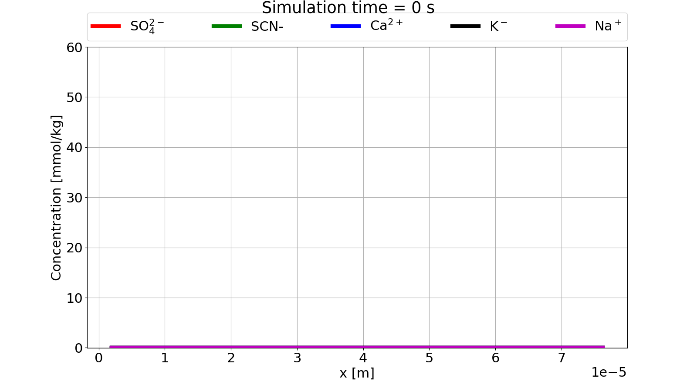
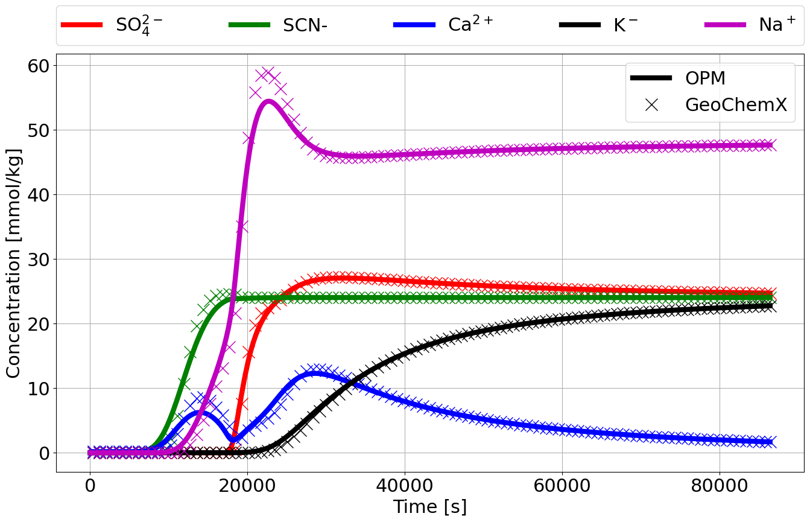
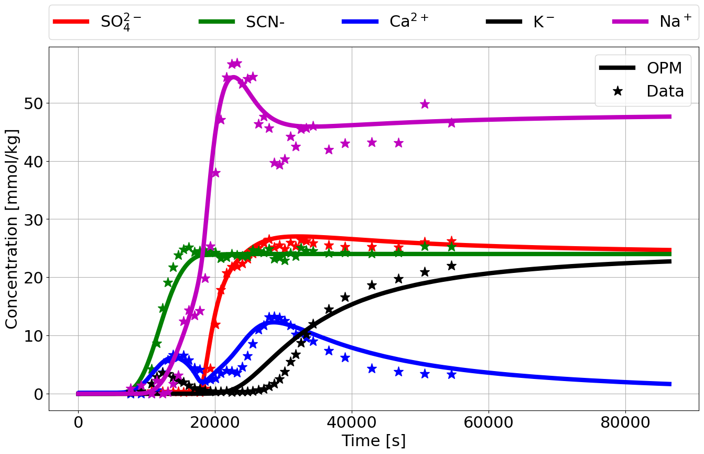

# Core flooding with adsorption of sulphate and cation exchange

This tutorial is the same as shown for the standalone `GeoChemX` program given here: [Adsorption of sulphate and cation
exchange in core](../../geochemx/transportII/notebook/main_transportII.ipynb). Furthermore, OPM Flow deck keywords are
explained in more details in the [PHREEQC example 11](../phreeqc_ex_11/PHREEQC_ex_11.md) and [Mineral
reactions](../mineral_interaction/magnesite_calcite_example.md) tutorials. We will therefore not go into much details on
the setup of the simulations here.

## OPM Flow deck

We will focus on the specific keywords for setting up the geochemistry parts of the deck, and refer to the [OPM Flow
manual](https://opm-project.org/?page_id=955) for other keywords encountered in the [full deck](./opm/TRANSPORTII.DATA).

Geochemistry is activated using the `GEOCHEM` keyword:

```
RUNSPEC

[...]

GEOCHEM
    transportII.json  1e-7 1e-8 CHARGE    /
```

The first item is a [JSON file](./opm/transportII.json) with information that will be forwarded to the geochemistry
solver:

```json
{
    "BASIS_SPECIES": [
        "SCN- 5 58.08 / HKF 909090 9 /"
    ],

    "COMPLEX" : {
        "COMPLEX 0" : {
            "METHOD": "1",
            "S_AREA": "5000.0 10",
            "GCa": "4.95",
            "GCO3": "4.95"
        }
    }
}
```
The `BASIS_SPECIES` adds a new, user-specified basis species with database information as explained
[here](../../geochemx/transport/notebook/main_transport.ipynb), while the `COMPLEX` block defines surface complexation
as explained [here](../../geochemx/complex/notebook/main_complex.ipynb).

The second and third item in `GEOCHEM` keyword are material balance and pH convergence tolerances, while the forth item
forces charge balance in the geochemical equilibrium solver.

The transported species, minerals, and ion exchange are defined with the `SPECIES`, `MINERAL`, and `IONEX` keywords in
the `PROPS` section:

```
PROPS

[...]

SPECIES
    H HCO3 CA NA K SCN- SO4 /

MINERAL
    CALCITE /

IONEX
    X /
```

>**NOTE**: `SCN-` is the user-defined species given in the [JSON input file](./opm/transportII.json).

The initial conditions for the transported species are given through `<S/M/I>BLK<name>` keywords in the `SOLUTION`
section:

```
SOLUTION

[...]

SBLKH
    20*1.0 /
SBLKHCO3
    20*1e-8 /
SBLKCA
    20*1e-8 /
SBLKNA
    20*0.0 /
SBLKK
    20*0.0 /
SBLKSCN-
    20*0.0 /
SBLKSO4
    20*0.0 /

MBLKCALCITE
    20*1.0 /

IBLKX
    20*0.09 /
```

The in- and outflow of water (with aqueous species) are handled by standard well keywords (see [OPM Flow
manual](https://opm-project.org/?page_id=955)) and the `WSPECIES` keyword:

```
SCHEDULE

[...]

WSPECIES
    INJ NA   4.8e-2 /
    INJ K    2.4e-2 /
    INJ SCN- 2.4e-2 /
    INJ SO4  2.4e-2 /
/
```

## Run simulation

The OPM Flow [deck](./opm/TRANSPORTII.DATA) is run with the following command:

```bash
flow_onephase_geochemistry --enable-opm-rst-file=true --solver-max-time-step-in-days=2e-4 TRANSPORTII.DATA
```

## Simulation results

A video of transported species:
<div align="center">
    
</div>

Comparison between OPM Flow and `GeoChemX` results:
<div align="center">
    
</div>

Comparison of OPM Flow and data:
<div align="center">
    
</div>
