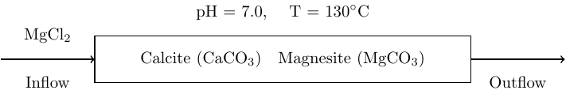
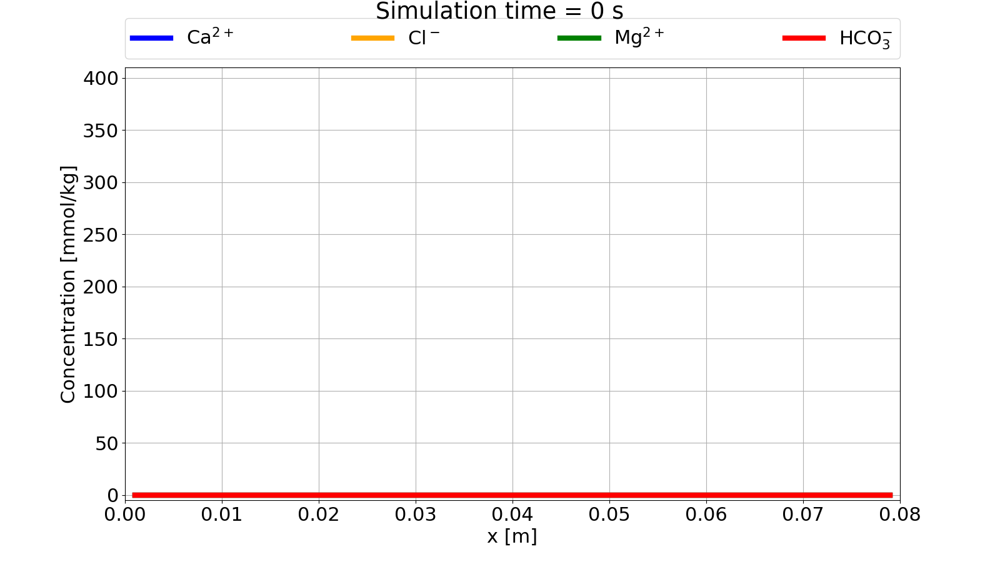
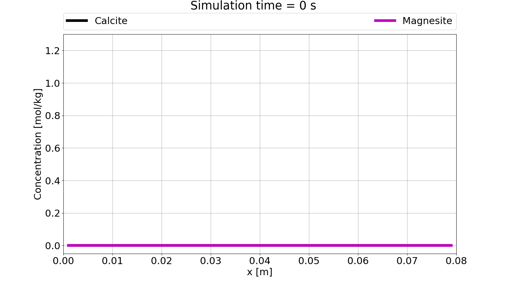
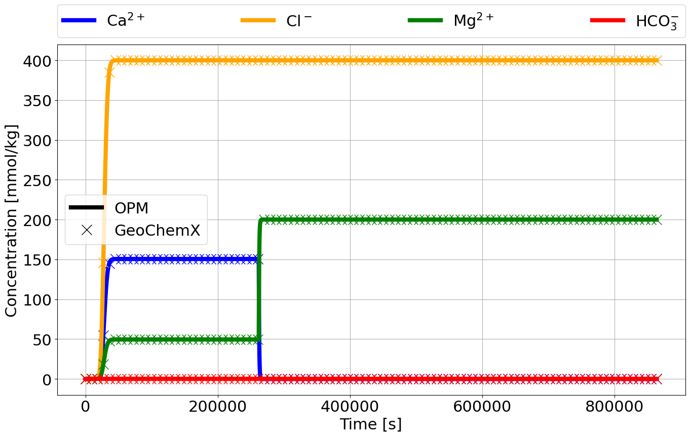

# Mineral Reactions Example - Calcite and Magnesite

This tutorial showcase mineral reactions in a simple 1D core flood simulation. The core is initially filled with water
and calcite in equilibrium. As the core is flooded with magnesite chloride from left to right, calcite is completely
dissolved and magnesite is precipitated in a one-to-one ratio.

<div align="center">
    
</div>

The core flood simulatino is run in OPM Flow as a single phase, water flow with wells for in- and outflow of water with
chemical species. Since the chemical species does not affect the properties of the fluid, this is in essence a tracer
transport problem with local chemical equilibrium calculations.

## OPM Flow deck
We will only point out selected keywords necessary to set up the reactive transport, and refer to the [OPM Flow
manual](https://opm-project.org/?page_id=955) for other keywords encountered in the [full deck](./opm/MG_CC.DATA).

Geochemistry is activated using the `GEOCHEM` keyword:

```
RUNSPEC

[...]

GEOCHEM
    1*  1e-7 1e-8 CHARGE    /
```

The first item is a JSON file name for all inputs to the geochemical solver that are not passed through the deck (not
needed in this example). The second and third item are material balance and pH convergence tolerances, while the forth
item forces charge balance in the geochemical equilibrium solver.

The transported species are defined with the `SPECIES` keyword in the `PROPS` section:

```
PROPS

[...]

SPECIES
    CA CL H HCO3 MG    /
```

The species are as follows:
- `CA`: calcium (Ca<sup>2+</sup>)
- `CL`: chlorine (Cl<sup>-</sup>)
- `H`: hydrogen (H<sup>+</sup>)
- `HCO3`: bicarbonate (HCO<sub>3</sub><sup>-</sup>)
- `MG`: magnesium (Mg<sup>2+</sup>)


The minerals are defined in the `MINERAL` keyword in the `PROPS` section:
```
PROPS

[...]

MINERAL
    CAL MGS /
```

The minerals have been given by their database "nickname", and are as follows:
- `CAL`: calcite (CaCO<sub>3</sub>)
- `MGS`: magnesite (MgCO<sub>3</sub>)

> **NOTE**: A full list of accepted minerals in the geochemistry solver can be found
> [here](../../geochemx/equilibrium_phases/notebook/main_equilibrium_phases.ipynb).

> **WARNING**: Minerals given in `MINERAL` cannot be more than 8 characters long! Use mineral nicknames (if possible) in
> such cases.

Initial conditions for the transported species are given with the `SBLK<name>` keyword, where `<name>` must be the same
as given in `SPECIES`:

```
SOLUTION

[...]

SBLKCA
    40*0.0    /
SBLKH
    40*1.0    /
SBLKMG
    40*0.0    /
SBLKCL
    40*0.0    /
SBLKHCO3
    40*0.0    /
```

We see that all species, except `H`, are initialized with zero concentration, since they will either be calculated from
the minerals or injected in the wells.

The initial conditions for the minerals are given in terms of weight fractions relative to the rock. Internally, the
initial concentration of minerals and species are done during an initial equilibrium solve. The weight fractions are
given in the `MBLK<name>` keyword, where `<name>` must be the same as given in `MINERAL`:

```
SOLUTION

[...]

MBLKCAL
    40*0.005    /
MBLKMGS
    40*0.0    /
```

> **NOTE**: The weight percentage must sum to 1.0, hence any remaining weight percent that is not given in `MINERAL` is
defined as a standard sandstone with a set density.

> **WARNING**: If the `<name>` of the mineral is more than 4 characters long, only the first four characters are used in
> `MBLK<name>` or `MVDP<name>`. This is due to the limitation that the total number of characters for a keyword in OPM
> Flow cannot be longer than 8 characters. An error will be given if the first four characters for two (or more)
> minerals are the same (e.g. magnesite and magnetite). Using nicknames for minerals, as in this tutorial, might be
> safest to avoid naming conflicts!

The in- and outflow of water (with aqueous species) are handled by standard well keywords (see [OPM Flow
manual](https://opm-project.org/?page_id=955)), but injection of calcium chloride is given by `WSPECIES` in the
`SCHEDULE` section:

```
SCHEDULE

[...]

WSPECIES
    INJ MG 0.2    /
    INJ CL 0.4    /
/
```

## Run simulation
The [OPM Flow deck](#opm-flow-deck) is run using the `flow_onephase_geochemistry` binary with flags to limit time steps,
due to explicit scheme for reactive transport, and output of geochemistry variables for visualization:

```bash
flow_onephase_geochemistry --enable-opm-rst-file=true --solver-max-time-step-in-days=2e-3 MG_CC.DATA
```

## Simulation results
Video of the development of species concentrations and mineral concentration:
<div align="center">
    
</div>
<div align="center">
    
</div>

Comparison of effluent aqueous species concentration between OPM Flow and GeoChemX:
<div align="center">
    
</div>
<br></br>

> **NOTE**:
> Command line for running the [.dat file](./geochemx/mg_cc.dat) with GeoChemX:
> ```
> GeoChemX TRANSPORT mg_cc.dat
> ```
> A file labeled `mg_ccOneDEff.out` contains effluent species concentrations and can be open in a CSV viewer, e.g.
> Excel.