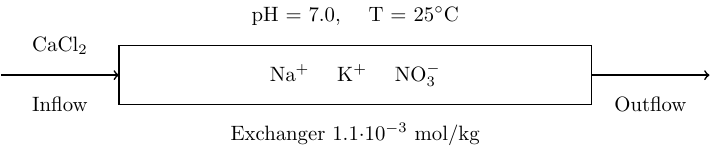
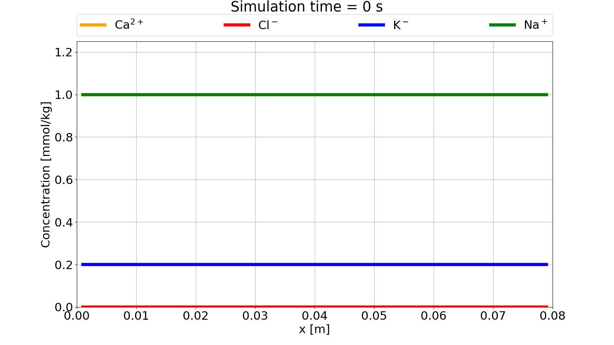
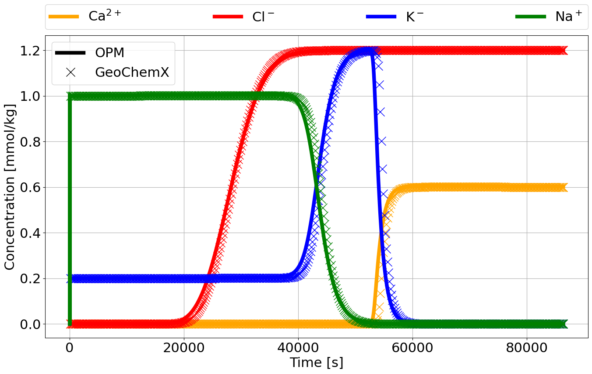

# PHREEQC Example 11 - Transport and Cation Exchange

The following tutorial is based on Example 11 from the PHREEQC
[documentation](https://pubs.usgs.gov/publication/tm6A43). The setup is a simple 1D core with initial
sodium-potassium-nitrate in equilibrium with a cation exchanger. The core is flooded with calcium chloride from left to
right, with calcium, potassium and sodium reacting with the exchanger at all times.

<div align="center">
    
</div>

The reactive transport simulation in OPM Flow is set up as a single phase, water flow with wells for in- and outflow of
water with chemical species. Since the chemical species does not affect the properties of the fluid, this is in essence
a tracer transport problem with local chemical equilibrium calculations.

## OPM Flow input
We will only point out selected keywords necessary to set up the reactive transport, and refer to the [OPM Flow
manual](https://opm-project.org/?page_id=955) for other keywords encountered in the [full deck](./opm/EX11.DATA).

The geochemical model is activated using the `GEOCHEM` keyword in the `RUNSPEC` section:

```
RUNSPEC

[...]

GEOCHEM
    1* 1e-7 1e-8 CHARGE    /
```

The first item is a JSON file name for all inputs to the geochemical solver that are not passed through the deck (not
needed in this example). The second and third item are material balance and pH convergence tolerances, while the forth
item forces charge balance in the geochemical equilibrium solver.

All transported species must be given in the `SPECIES` keyword in the `PROPS` section:

```
PROPS

[...]

SPECIES
    CA CL K NO3 NA H    /
```

The species are as follows:
- `CA`: calcium (Ca<sup>2+</sup>)
- `CL`: chlorine (Cl<sup>-</sup>)
- `K`: potassium (K<sup>+</sup>)
- `NO3`: nitrate (NO<sup>-</sup><sub>3</sub>)
- `NA`: sodium (Na<sup>+</sup>)
- `H`: hydrogen (H<sup>+</sup>)


> **NOTE**: `SPECIES` must contain all transported species encountered in the simulations! This also includes species
> that are implicitly present through, e.g., mineral precipitations/dissolution (as in the [mineral reaction
> example](../mineral_interaction/magnesite_calcite_example.md))! An error will be given if there are inconsistencies
> between OPM Flow deck species and internal geochemistry solver definitions. A full list of accepted basis species for
> the geochemistry solver can be found in the Appendix [here](../../geochemx/solution/notebook/main_solution.ipynb). To
> avoid possible formatting issues it is recommended to use nicknames for the species.

Similar to the species definition, the cation exchanger is defined in the `IONEX` keyword in the `PROPS` section:

```
PROPS

[...]

IONEX
    X    /
```

>**NOTE** A default name of `X` is hard-coded for an ion exchanger in the geochemical solver! For more information on
>the ion exchange in the geochemistry solver see [here](../../geochemx/iexchange/notebook/main_iexchange.ipynb).

The initial conditions for each species are given one at the time using the `SBLK<name>` keyword in the `SOLUTION`
section, where `<name>` refers to names given in `SPECIES`:

```
SOLUTION

[...]

SBLKK
    40*0.2e-3    /
SBLKNO3
    40*1.2e-3    /
SBLKNA
    40*1.0e-3    /
SBLKH
    40*1.0    /
SBLKCA
    40*0.0    /
SBLKCL
    40*0.0    /
```

Initial condition for the cation exchanger is given in similiar manner using the `IBLK<name>` keyword in the `SOLUTION`
section, where `<name>` refers to the name given in `IONEX`:
```
SOLUTION

[...]

IBLKX
    40*1.1e-3    /
```

> **NOTE**: Initial conditions for species and ion exchangers can also be given as concentration vs depth using
> `SVDP<name>` and `IVDP<name>` keywords, respecitively, also located in the `SOLUTION` section. For example, for
> potassium:
> ```
> SVDPK
> --  concentration    depth
>     0.2e-3           100
>     0.2e-3           200    /
> ```
> would give the same initial condition as given with `SBLKK` above.

> **NOTE**: `SUMMARY` keywords to get time series of species are currently defined using tracer monikers, see well
> tracer outputs in the [OPM Flow manual](https://opm-project.org/?page_id=955). For example, to get well production
rate of calcium in a well named `PROD`, one would write in the `SUMMARY` section:
>```
> SUMMARY
>
> [...]
>
>WTPRCA
>     PROD    /
> ```

The in- and outflow of water are handled by standard well keywords (see [OPM Flow
manual](https://opm-project.org/?page_id=955)), but injection of species such as calcium chloride is given by `WSPECIES`
in the `SCHEDULE` section:

```
SCHEDULE

[...]

WSPECIES
    INJ CA 0.6e-3    /
    INJ CL 1.2e-3    /
/
```

## Run simulation
The [OPM Flow deck](#opm-flow-deck) is run using the `flow_onephase_geochemistry` binary with flags to limit time steps,
due to explicit scheme for reactive transport, and output of geochemistry variables for visualization:

```bash
flow_onephase_geochemistry --enable-opm-rst-file=true --solver-max-time-step-in-days=2e-4 EX11.DATA
```

## Simulation results
The core flood experiment is run over a time intervall of 24 h = 86400 s. A video of the time evolution for some of the
species concentrations over the length of the core is shown here:

<div align="center">
    
</div>

When calcium chloride is injected into the core at the left side, the calcium, potassium and sodium reacts with the
cation exchanger. Chlorine is an inert ion and will flow through the core affected only by advection.

Time series of the simulation results at the effluent are compared to results running the 1D transport module of
GeoChemX (.dat file located [here](./geochemx/ex11.dat)). Both run explicit version the reactive transport equations
and show good agreement in the results:

<div align="center">
    
</div>
<br></br>

> **NOTE**:
> Command line for running the .dat file with GeoChemX:
> ```
> GeoChemX TRANSPORT ex11.dat
> ```
> A file labeled `ex11OneDEff.out` contains effluent species concentrations and can be open in a CSV viewer, e.g. Excel.
